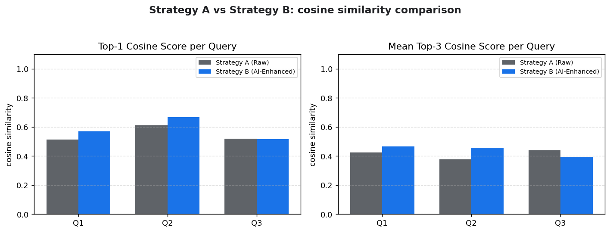

# Retrieval Benchmark - Strategy A vs Strategy B

Auto-generated comparison of Raw Vector Search (A) vs AI-Enhanced Retrieval (B).

- Top-K: **3**
- Similarity metric: **cosine**
- Embedding model: **sentence-transformers/all-MiniLM-L6-v2** (mocks Vertex `textembedding-gecko`)
- Vector store: **FAISS** `IndexFlatIP` (file-backed, PDF-compliant)
- Query expander: **anthropic** (claude-haiku-4-5-20251001)
- Queries evaluated: **3**



## Aggregate Results

| Metric | Strategy A (Raw) | Strategy B (AI-Enhanced) | Delta |
|---|---|---|---|
| Mean top-1 cosine score | 0.5480 | 0.5845 | **+0.0365** |
| Mean top-3 cosine score | 0.4132 | 0.4390 | **+0.0258** |
| Hit Rate @ 3 | 1.0000 | 1.0000 | **+0.0000** |
| MRR | 1.0000 | 1.0000 | **+0.0000** |
| nDCG @ 3 | 1.0000 | 0.9218 | **-0.0782** |
| Mean latency (ms) | 41.2 | 3475.9 | **+3434.6** |

**Per-query winner:** Strategy A wins 1, Strategy B wins 2, ties 0 (threshold: cosine delta > 0.01)

## Per-Query Summary

| # | Query | Winner | Mean A | Mean B | Uplift | Hit@3 A/B | MRR A/B |
|---|---|---|---|---|---|---|---|
| Q1 | How does the system handle peak load? | **B** | 0.4238 | 0.4661 | +0.0422 | 1.00/1.00 | 1.00/1.00 |
| Q2 | What happens when too many users hit the API at on... | **B** | 0.3773 | 0.4574 | +0.0801 | 1.00/1.00 | 1.00/1.00 |
| Q3 | Explain the failover mechanism during outages. | **A** | 0.4384 | 0.3936 | -0.0448 | 1.00/1.00 | 1.00/1.00 |

## Query 1: "How does the system handle peak load?"

**Strategy B expanded query:** `How does the system manage handle process peak load traffic surge high demand maximum capacity stress testing performance under load scalability load balancing resource allocation during peak hours traffic spikes concurrent users server capacity bottleneck mitigation auto-scaling elastic scaling throughput latency response time under heavy load infrastructure scaling cloud resources capacity planning performance optimization during peak traffic periods`

| Rank | Strategy A (Raw) | Score | Strategy B (Expanded) | Score |
|------|------------------|-------|------------------------|-------|
| 1 | The system handles peak load through horizontal auto-scaling powered by Kubernet... | 0.5135 | The system handles peak load through horizontal auto-scaling powered by Kubernet... | 0.5693 |
| 2 | Incoming traffic is distributed across regional load balancers operating at both... | 0.3939 | APIs are protected by a tiered rate-limiting system using token-bucket and leaky... | 0.4178 |
| 3 | APIs are protected by a tiered rate-limiting system using token-bucket and leaky... | 0.3641 | Incoming traffic is distributed across regional load balancers operating at both... | 0.4111 |

_Latency A: embed 77.5ms / search 0.2ms_ - _Latency B: expand 3125.0ms / embed 64.8ms / search 0.3ms_

## Query 2: "What happens when too many users hit the API at once?"

**Strategy B expanded query:** `What happens when too many concurrent users simultaneously access the API at the same time? How does the system handle high traffic load, traffic spikes, and request surges? What is the impact of exceeding rate limits, throttling, and API capacity? How do rate limiting, request queuing, and traffic management work? What are the consequences of overload conditions, server saturation, and resource exhaustion? How does the system respond to DDoS attacks, traffic congestion, and bottlenecks? What happens during peak usage, burst traffic, and sudden demand? How are requests`

| Rank | Strategy A (Raw) | Score | Strategy B (Expanded) | Score |
|------|------------------|-------|------------------------|-------|
| 1 | APIs are protected by a tiered rate-limiting system using token-bucket and leaky... | 0.6124 | APIs are protected by a tiered rate-limiting system using token-bucket and leaky... | 0.6665 |
| 2 | Incoming traffic is distributed across regional load balancers operating at both... | 0.2687 | Incoming traffic is distributed across regional load balancers operating at both... | 0.3564 |
| 3 | The system handles peak load through horizontal auto-scaling powered by Kubernet... | 0.2509 | The system handles peak load through horizontal auto-scaling powered by Kubernet... | 0.3493 |

_Latency A: embed 28.2ms / search 0.1ms_ - _Latency B: expand 4178.5ms / embed 63.6ms / search 0.1ms_

## Query 3: "Explain the failover mechanism during outages."

**Strategy B expanded query:** `Explain the failover mechanism during outages, system failures, and service disruptions. How does automatic failover work? What are failover strategies, redundancy mechanisms, and backup systems? Discuss failover protocols, high availability architectures, disaster recovery procedures, system resilience, and fault tolerance techniques. Include information about failover detection, failover triggers, switchover processes, recovery procedures, downtime mitigation, business continuity planning, and infrastructure failover handling during network outages, server failures, database failures, and application crashes.`

| Rank | Strategy A (Raw) | Score | Strategy B (Expanded) | Score |
|------|------------------|-------|------------------------|-------|
| 1 | The primary database operates in a multi-AZ configuration with synchronous repli... | 0.5181 | The primary database operates in a multi-AZ configuration with synchronous repli... | 0.5178 |
| 2 | Disaster recovery procedures define an RPO of 5 minutes and an RTO of 30 minutes... | 0.4372 | Disaster recovery procedures define an RPO of 5 minutes and an RTO of 30 minutes... | 0.4152 |
| 3 | Incoming traffic is distributed across regional load balancers operating at both... | 0.3599 | The system handles peak load through horizontal auto-scaling powered by Kubernet... | 0.2478 |

_Latency A: embed 17.6ms / search 0.1ms_ - _Latency B: expand 2927.6ms / embed 67.5ms / search 0.1ms_

## Methodology

- **Hit Rate @ K** - fraction of queries where at least one of the top-K retrieved documents is in the ground-truth relevant set.
- **MRR (Mean Reciprocal Rank)** - 1 / position of the first relevant result, averaged across queries.
- **nDCG @ K** - normalized discounted cumulative gain, rewards relevant results appearing at higher ranks.
- **Ground truth** - hand-labeled per query in `app/Services/benchmark_metrics.py :: GROUND_TRUTH`.
- **Winner** - strategy with higher mean cosine score across the top-K results (threshold 0.01 to flag ties).
- **Latency** - end-to-end retrieval time excluding generation. Strategy B includes an additional LLM call for query expansion.

## Raw JSON

```json
{
  "top_k": 3,
  "queries": [
    {
      "query": "How does the system handle peak load?",
      "strategy_a": {
        "results": [
          {
            "chunk_id": "a7842a68-0-50471deeed4cebd2",
            "doc_id": "a7842a680dad",
            "text": "The system handles peak load through horizontal auto-scaling powered by Kubernetes HPA. When CPU utilization crosses 70% or request latency p95 exceeds 300ms, new pods are spun up from a warm pool. A predictive scaler also pre-provisions capacity during known traffic spikes such as marketing campaigns. Connection draining ensures in-flight requests complete before pods are terminated during scale-down.",
            "source": "auto_scaling.txt",
            "score": 0.5135,
            "rank": 1,
            "strategy": "A"
          },
          {
            "chunk_id": "2fe17f67-0-cd5d5655f1a85fa7",
            "doc_id": "2fe17f670bf6",
            "text": "Incoming traffic is distributed across regional load balancers operating at both L4 and L7. The L7 layer performs path-based routing, TLS termination, and weighted canary deployments. Sticky sessions are used only for stateful upload flows; everything else is fully stateless to permit any-node routing. Health checks at 5-second intervals remove unhealthy backends from rotation within 15 seconds.",
            "source": "load_balancer.txt",
            "score": 0.3939,
            "rank": 2,
            "strategy": "A"
          },
          {
            "chunk_id": "f70f2662-0-0d820cc207d156bf",
            "doc_id": "f70f266260ee",
            "text": "APIs are protected by a tiered rate-limiting system using token-bucket and leaky-bucket algorithms. Anonymous traffic is capped per IP at 60 requests per minute, while authenticated users get per-key quotas based on plan. Burst credits accumulate to absorb sudden spikes without starvation. Throttled clients receive a 429 response with a Retry-After header to enable polite client backoff.",
            "source": "rate_limiting.txt",
            "score": 0.3641,
            "rank": 3,
            "strategy": "A"
          }
        ],
        "timings_ms": {
          "embed_ms": 77.45780004188418,
          "search_ms": 0.19569997675716877,
          "expand_ms": 0.0
        }
      },
      "strategy_b": {
        "expanded_query": "How does the system manage handle process peak load traffic surge high demand maximum capacity stress testing performance under load scalability load balancing resource allocation during peak hours traffic spikes concurrent users server capacity bottleneck mitigation auto-scaling elastic scaling throughput latency response time under heavy load infrastructure scaling cloud resources capacity planning performance optimization during peak traffic periods",
        "results": [
          {
            "chunk_id": "a7842a68-0-50471deeed4cebd2",
            "doc_id": "a7842a680dad",
            "text": "The system handles peak load through horizontal auto-scaling powered by Kubernetes HPA. When CPU utilization crosses 70% or request latency p95 exceeds 300ms, new pods are spun up from a warm pool. A predictive scaler also pre-provisions capacity during known traffic spikes such as marketing campaigns. Connection draining ensures in-flight requests complete before pods are terminated during scale-down.",
            "source": "auto_scaling.txt",
            "score": 0.5693,
            "rank": 1,
            "strategy": "B"
          },
          {
            "chunk_id": "f70f2662-0-0d820cc207d156bf",
            "doc_id": "f70f266260ee",
            "text": "APIs are protected by a tiered rate-limiting system using token-bucket and leaky-bucket algorithms. Anonymous traffic is capped per IP at 60 requests per minute, while authenticated users get per-key quotas based on plan. Burst credits accumulate to absorb sudden spikes without starvation. Throttled clients receive a 429 response with a Retry-After header to enable polite client backoff.",
            "source": "rate_limiting.txt",
            "score": 0.4178,
            "rank": 2,
            "strategy": "B"
          },
          {
            "chunk_id": "2fe17f67-0-cd5d5655f1a85fa7",
            "doc_id": "2fe17f670bf6",
            "text": "Incoming traffic is distributed across regional load balancers operating at both L4 and L7. The L7 layer performs path-based routing, TLS termination, and weighted canary deployments. Sticky sessions are used only for stateful upload flows; everything else is fully stateless to permit any-node routing. Health checks at 5-second intervals remove unhealthy backends from rotation within 15 seconds.",
            "source": "load_balancer.txt",
            "score": 0.4111,
            "rank": 3,
            "strategy": "B"
          }
        ],
        "timings_ms": {
          "embed_ms": 64.82929992489517,
          "search_ms": 0.25349995121359825,
          "expand_ms": 3125.04870002158
        }
      }
    },
    {
      "query": "What happens when too many users hit the API at once?",
      "strategy_a": {
        "results": [
          {
            "chunk_id": "f70f2662-0-0d820cc207d156bf",
            "doc_id": "f70f266260ee",
            "text": "APIs are protected by a tiered rate-limiting system using token-bucket and leaky-bucket algorithms. Anonymous traffic is capped per IP at 60 requests per minute, while authenticated users get per-key quotas based on plan. Burst credits accumulate to absorb sudden spikes without starvation. Throttled clients receive a 429 response with a Retry-After header to enable polite client backoff.",
            "source": "rate_limiting.txt",
            "score": 0.6124,
            "rank": 1,
            "strategy": "A"
          },
          {
            "chunk_id": "2fe17f67-0-cd5d5655f1a85fa7",
            "doc_id": "2fe17f670bf6",
            "text": "Incoming traffic is distributed across regional load balancers operating at both L4 and L7. The L7 layer performs path-based routing, TLS termination, and weighted canary deployments. Sticky sessions are used only for stateful upload flows; everything else is fully stateless to permit any-node routing. Health checks at 5-second intervals remove unhealthy backends from rotation within 15 seconds.",
            "source": "load_balancer.txt",
            "score": 0.2687,
            "rank": 2,
            "strategy": "A"
          },
          {
            "chunk_id": "a7842a68-0-50471deeed4cebd2",
            "doc_id": "a7842a680dad",
            "text": "The system handles peak load through horizontal auto-scaling powered by Kubernetes HPA. When CPU utilization crosses 70% or request latency p95 exceeds 300ms, new pods are spun up from a warm pool. A predictive scaler also pre-provisions capacity during known traffic spikes such as marketing campaigns. Connection draining ensures in-flight requests complete before pods are terminated during scale-down.",
            "source": "auto_scaling.txt",
            "score": 0.2509,
            "rank": 3,
            "strategy": "A"
          }
        ],
        "timings_ms": {
          "embed_ms": 28.187799965962768,
          "search_ms": 0.11939997784793377,
          "expand_ms": 0.0
        }
      },
      "strategy_b": {
        "expanded_query": "What happens when too many concurrent users simultaneously access the API at the same time? How does the system handle high traffic load, traffic spikes, and request surges? What is the impact of exceeding rate limits, throttling, and API capacity? How do rate limiting, request queuing, and traffic management work? What are the consequences of overload conditions, server saturation, and resource exhaustion? How does the system respond to DDoS attacks, traffic congestion, and bottlenecks? What happens during peak usage, burst traffic, and sudden demand? How are requests",
        "results": [
          {
            "chunk_id": "f70f2662-0-0d820cc207d156bf",
            "doc_id": "f70f266260ee",
            "text": "APIs are protected by a tiered rate-limiting system using token-bucket and leaky-bucket algorithms. Anonymous traffic is capped per IP at 60 requests per minute, while authenticated users get per-key quotas based on plan. Burst credits accumulate to absorb sudden spikes without starvation. Throttled clients receive a 429 response with a Retry-After header to enable polite client backoff.",
            "source": "rate_limiting.txt",
            "score": 0.6665,
            "rank": 1,
            "strategy": "B"
          },
          {
            "chunk_id": "2fe17f67-0-cd5d5655f1a85fa7",
            "doc_id": "2fe17f670bf6",
            "text": "Incoming traffic is distributed across regional load balancers operating at both L4 and L7. The L7 layer performs path-based routing, TLS termination, and weighted canary deployments. Sticky sessions are used only for stateful upload flows; everything else is fully stateless to permit any-node routing. Health checks at 5-second intervals remove unhealthy backends from rotation within 15 seconds.",
            "source": "load_balancer.txt",
            "score": 0.3564,
            "rank": 2,
            "strategy": "B"
          },
          {
            "chunk_id": "a7842a68-0-50471deeed4cebd2",
            "doc_id": "a7842a680dad",
            "text": "The system handles peak load through horizontal auto-scaling powered by Kubernetes HPA. When CPU utilization crosses 70% or request latency p95 exceeds 300ms, new pods are spun up from a warm pool. A predictive scaler also pre-provisions capacity during known traffic spikes such as marketing campaigns. Connection draining ensures in-flight requests complete before pods are terminated during scale-down.",
            "source": "auto_scaling.txt",
            "score": 0.3493,
            "rank": 3,
            "strategy": "B"
          }
        ],
        "timings_ms": {
          "embed_ms": 63.621000153943896,
          "search_ms": 0.10189996100962162,
          "expand_ms": 4178.528899792582
        }
      }
    },
    {
      "query": "Explain the failover mechanism during outages.",
      "strategy_a": {
        "results": [
          {
            "chunk_id": "45376b63-0-464df2f306948929",
            "doc_id": "45376b63bc04",
            "text": "The primary database operates in a multi-AZ configuration with synchronous replication to a standby replica in a separate availability zone. During an outage, automatic failover promotes the replica to primary within 30 seconds, achieving an RTO of under one minute. Async read replicas in additional regions absorb heavy analytics queries. Point-in-time recovery is supported through continuous WAL archival.",
            "source": "database_failover.txt",
            "score": 0.5181,
            "rank": 1,
            "strategy": "A"
          },
          {
            "chunk_id": "d8824a85-0-5db6ab3d353ca30e",
            "doc_id": "d8824a856125",
            "text": "Disaster recovery procedures define an RPO of 5 minutes and an RTO of 30 minutes. Cross-region replication maintains warm standbys, and quarterly game-day exercises validate the failover runbook. Incident commanders coordinate response via a runbook playbook with auto-paging to on-call engineers. Post-incident reviews are blameless and action-item driven, fed back into reliability work.",
            "source": "disaster_recovery.txt",
            "score": 0.4372,
            "rank": 2,
            "strategy": "A"
          },
          {
            "chunk_id": "2fe17f67-0-cd5d5655f1a85fa7",
            "doc_id": "2fe17f670bf6",
            "text": "Incoming traffic is distributed across regional load balancers operating at both L4 and L7. The L7 layer performs path-based routing, TLS termination, and weighted canary deployments. Sticky sessions are used only for stateful upload flows; everything else is fully stateless to permit any-node routing. Health checks at 5-second intervals remove unhealthy backends from rotation within 15 seconds.",
            "source": "load_balancer.txt",
            "score": 0.3599,
            "rank": 3,
            "strategy": "A"
          }
        ],
        "timings_ms": {
          "embed_ms": 17.615499906241894,
          "search_ms": 0.10520010255277157,
          "expand_ms": 0.0
        }
      },
      "strategy_b": {
        "expanded_query": "Explain the failover mechanism during outages, system failures, and service disruptions. How does automatic failover work? What are failover strategies, redundancy mechanisms, and backup systems? Discuss failover protocols, high availability architectures, disaster recovery procedures, system resilience, and fault tolerance techniques. Include information about failover detection, failover triggers, switchover processes, recovery procedures, downtime mitigation, business continuity planning, and infrastructure failover handling during network outages, server failures, database failures, and application crashes.",
        "results": [
          {
            "chunk_id": "45376b63-0-464df2f306948929",
            "doc_id": "45376b63bc04",
            "text": "The primary database operates in a multi-AZ configuration with synchronous replication to a standby replica in a separate availability zone. During an outage, automatic failover promotes the replica to primary within 30 seconds, achieving an RTO of under one minute. Async read replicas in additional regions absorb heavy analytics queries. Point-in-time recovery is supported through continuous WAL archival.",
            "source": "database_failover.txt",
            "score": 0.5178,
            "rank": 1,
            "strategy": "B"
          },
          {
            "chunk_id": "d8824a85-0-5db6ab3d353ca30e",
            "doc_id": "d8824a856125",
            "text": "Disaster recovery procedures define an RPO of 5 minutes and an RTO of 30 minutes. Cross-region replication maintains warm standbys, and quarterly game-day exercises validate the failover runbook. Incident commanders coordinate response via a runbook playbook with auto-paging to on-call engineers. Post-incident reviews are blameless and action-item driven, fed back into reliability work.",
            "source": "disaster_recovery.txt",
            "score": 0.4152,
            "rank": 2,
            "strategy": "B"
          },
          {
            "chunk_id": "a7842a68-0-50471deeed4cebd2",
            "doc_id": "a7842a680dad",
            "text": "The system handles peak load through horizontal auto-scaling powered by Kubernetes HPA. When CPU utilization crosses 70% or request latency p95 exceeds 300ms, new pods are spun up from a warm pool. A predictive scaler also pre-provisions capacity during known traffic spikes such as marketing campaigns. Connection draining ensures in-flight requests complete before pods are terminated during scale-down.",
            "source": "auto_scaling.txt",
            "score": 0.2478,
            "rank": 3,
            "strategy": "B"
          }
        ],
        "timings_ms": {
          "embed_ms": 67.49069993384182,
          "search_ms": 0.0713001936674118,
          "expand_ms": 2927.625000011176
        }
      }
    }
  ],
  "metrics": {
    "per_query": [
      {
        "query": "How does the system handle peak load?",
        "winner": "B",
        "mean_score_a": 0.4238,
        "mean_score_b": 0.4661,
        "uplift": 0.0422,
        "hit_rate_3_a": 1.0,
        "hit_rate_3_b": 1.0,
        "mrr_a": 1.0,
        "mrr_b": 1.0,
        "ndcg_3_a": 1.0,
        "ndcg_3_b": 1.0,
        "latency_ms_a": 77.7,
        "latency_ms_b": 3190.1,
        "expansion_overhead_ms": 3125.0
      },
      {
        "query": "What happens when too many users hit the API at once?",
        "winner": "B",
        "mean_score_a": 0.3773,
        "mean_score_b": 0.4574,
        "uplift": 0.0801,
        "hit_rate_3_a": 1.0,
        "hit_rate_3_b": 1.0,
        "mrr_a": 1.0,
        "mrr_b": 1.0,
        "ndcg_3_a": 1.0,
        "ndcg_3_b": 1.0,
        "latency_ms_a": 28.3,
        "latency_ms_b": 4242.3,
        "expansion_overhead_ms": 4178.5
      },
      {
        "query": "Explain the failover mechanism during outages.",
        "winner": "A",
        "mean_score_a": 0.4384,
        "mean_score_b": 0.3936,
        "uplift": -0.0448,
        "hit_rate_3_a": 1.0,
        "hit_rate_3_b": 1.0,
        "mrr_a": 1.0,
        "mrr_b": 1.0,
        "ndcg_3_a": 1.0,
        "ndcg_3_b": 0.7654,
        "latency_ms_a": 17.7,
        "latency_ms_b": 2995.2,
        "expansion_overhead_ms": 2927.6
      }
    ],
    "aggregate": {
      "n_queries": 3,
      "wins_strategy_a": 1,
      "wins_strategy_b": 2,
      "ties": 0,
      "mean_top1_score_a": 0.548,
      "mean_top1_score_b": 0.5845,
      "mean_top3_score_a": 0.4132,
      "mean_top3_score_b": 0.439,
      "score_uplift_top1": 0.0365,
      "score_uplift_top3": 0.0258,
      "hit_rate_3_a": 1.0,
      "hit_rate_3_b": 1.0,
      "mrr_a": 1.0,
      "mrr_b": 1.0,
      "ndcg_3_a": 1.0,
      "ndcg_3_b": 0.9218,
      "mean_latency_ms_a": 41.2,
      "mean_latency_ms_b": 3475.9,
      "latency_overhead_ms": 3434.6
    }
  }
}
```